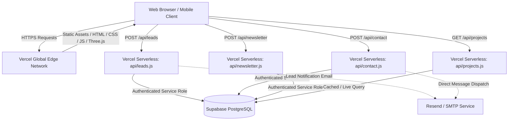

# CreativeOrbitz — Production Platform 🚀

Production-grade website and agency infrastructure for **CreativeOrbitz** — *"One Team. Every Creative Solution."*

Built with modern high-performance vanilla web technologies, Three.js WebGL 3D Creative World, Vercel Serverless Functions, and Supabase PostgreSQL.

---

## 🏛️ Production Architecture



---

## 📁 Repository Structure

```
creativeorbitz/
├── .env.example                                      # Environment variables template
├── .gitignore                                        # Production git ignore rules
├── index.html                                        # Full frontend with 3D WebGL engine & modal systems
├── package.json                                      # Project dependencies and deployment scripts
├── robots.txt                                        # Search engine crawler instructions
├── sitemap.xml                                       # Production XML sitemap
├── vercel.json                                       # Security headers, CSP & asset caching
├── server.js                                         # Local dev server & API emulator
│
├── api/                                              # Vercel Serverless Functions
│   ├── _supabase.js                                  # Secure Supabase client helper & rate limiter
│   ├── leads.js                                      # "Start a Project" lead intake & project request engine
│   ├── contact.js                                    # Direct message & inquiry handler
│   ├── newsletter.js                                 # CreativeOrbitz Dispatch newsletter subscription
│   └── projects.js                                   # Active portfolio & showcase fetcher
│
├── assets/                                           # Video portfolio & vendor libraries
│   ├── three.min.js                                  # Local Three.js r128 bundle (with CDN fallback)
│   └── videos/                                       # Raw & edited showcase reels
│
├── scripts/
│   ├── build.js                                      # Production build verification script
│   └── test-api.js                                   # Automated API integration test suite
│
└── supabase/
    ├── migrations/
    │   └── 20260917000000_production_schema.sql      # Complete SQL DDL schema with RLS policies
    └── seed.sql                                      # Initial project showcases & verified sample leads
```

---

## ⚡ Quick Start (Local Development)

1. **Install Dependencies**:
   ```bash
   npm install
   ```

2. **Run Production Build Verification**:
   ```bash
   npm run build
   ```

3. **Start Local Development Server**:
   ```bash
   npm run dev
   # Site active at http://localhost:3000
   ```

4. **Run API Integration Tests**:
   ```bash
   npm test
   ```

---

## 🗄️ Supabase PostgreSQL Setup

1. Create a free account at [Supabase](https://supabase.com) and click **New Project**.
2. Go to the **SQL Editor** in your Supabase dashboard.
3. Open `supabase/migrations/20260917000000_production_schema.sql`, paste the contents into the SQL Editor, and click **Run**.
4. (Optional) Run `supabase/seed.sql` to populate sample showcase data.
5. In your Supabase dashboard, navigate to **Project Settings > API** to find:
   - **Project URL** (`https://<project-ref>.supabase.co`)
   - **Anon Key** (Client public key)
   - **Service Role Key** (Keep strictly secret; used by serverless API endpoints)

---

## 🚢 Deploying to Vercel

1. **Push to GitHub**:
   ```bash
   git remote add origin https://github.com/<YOUR_GITHUB_USERNAME>/creativeorbitz.git
   git branch -M main
   git push -u origin main
   ```

2. **Import into Vercel**:
   - Go to [Vercel](https://vercel.com) and click **Add New > Project**.
   - Select your `creativeorbitz` GitHub repository.
   - Framework Preset: **Other** (Root directory `./`).

3. **Configure Environment Variables in Vercel**:
   Add the following variables under **Settings > Environment Variables**:

   | Variable Name | Value | Description |
   | ------------- | ----- | ----------- |
   | `SUPABASE_URL` | `https://<project-ref>.supabase.co` | Your Supabase Project URL |
   | `SUPABASE_ANON_KEY` | `eyJh...` | Public Supabase Anon Key |
   | `SUPABASE_SERVICE_ROLE_KEY` | `eyJh...` | Secret service role key for API handlers |
   | `RESEND_API_KEY` | `re_...` *(Optional)* | For email notifications on new leads |
   | `LEAD_NOTIFICATION_EMAIL` | `creativeorbitzz@gmail.com` | Destination inbox for lead alerts |

4. **Deploy**:
   - Click **Deploy**. Vercel will build and assign your production domain.

---

## 🌐 Custom Domain Setup

1. In the Vercel Dashboard, go to **Settings > Domains**.
2. Enter your domain (e.g. `creativeorbitz.com`).
3. Add the DNS records shown by Vercel to your domain registrar (GoDaddy, Namecheap, Cloudflare, etc.):
   - `A` record pointing `@` to `76.76.21.21`
   - `CNAME` record pointing `www` to `cname.vercel-dns.com`
4. SSL/TLS certificates will automatically provision within a few minutes.

---

## 🔒 Security & Privacy

- **Row Level Security (RLS)**: Enabled across all 5 database tables (`leads`, `project_requests`, `contact_messages`, `newsletter`, `projects`).
- **Secret Isolation**: `SUPABASE_SERVICE_ROLE_KEY` and `RESEND_API_KEY` are strictly server-side and never exposed to the client.
- **Vercel Security Headers**: Configured with `X-Content-Type-Options: nosniff`, `X-Frame-Options: SAMEORIGIN`, and strict referrers.
- **Zero Localhost Dependency**: Graceful fallback mode guarantees the site functions seamlessly even if Supabase keys are not yet configured.

---

© 2026 CreativeOrbitz. All rights reserved.
